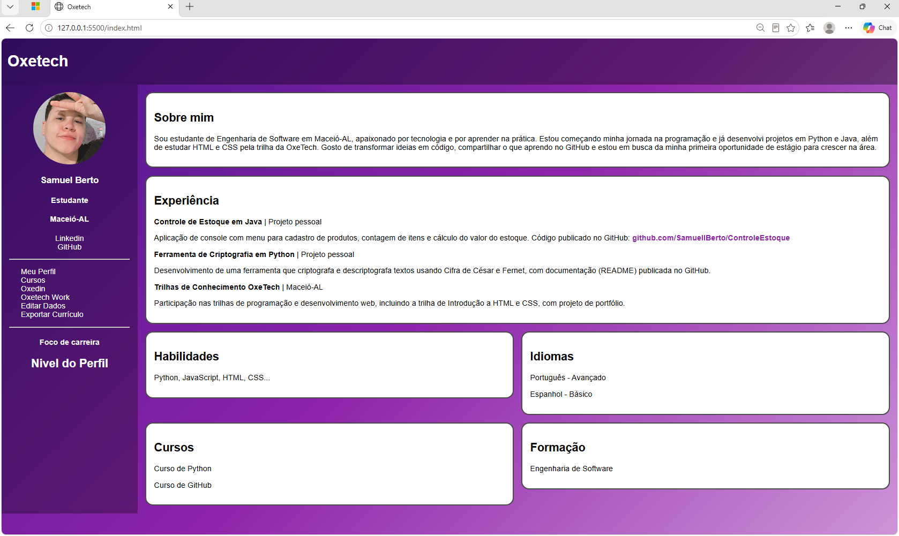

# Oxetech - Página de Portfólio

Página de portfólio pessoal criada com **HTML e CSS**, desenvolvida a partir do projeto da Aula 05 da trilha *Introdução a HTML e CSS* da OxeTech (Maceió-AL) e depois evoluída com melhorias próprias de layout e visual.

## Preview



## Funcionalidades

- Barra lateral com foto de perfil redonda, nome, ocupação, cidade, links e menu
- Seções em cards: Sobre mim, Experiência, Habilidades, Idiomas, Cursos e Formação
- Fundo em degradê roxo, com cabeçalho e barra lateral translúcidos
- Layout responsivo: em telas pequenas a lateral vai para o topo e os cards ficam em uma coluna

## Tecnologias

- **HTML5**: estrutura semântica (`header`, `aside`, `main`, `section`)
- **CSS3**:
  - Flexbox para dividir a barra lateral e o conteúdo
  - CSS Grid para organizar os cards em duas colunas
  - `linear-gradient` para o fundo
  - `border-radius` e `object-fit` para a foto circular
  - Media query para adaptação a telas pequenas

## Estrutura do projeto

```
HTML-Oxetech/
├── index.html    # Estrutura da página
├── style.css     # Estilos e layout
├── perfil.jpeg   # Foto de perfil
├── oxetech-html02.png   # Print da página
└── README.md
```

## Como executar

1. Baixe ou clone este repositório
2. Abra a pasta no VS Code
3. Abra o arquivo `index.html` no navegador (ou use a extensão Live Server)

Não é necessário instalar nenhuma dependência.

## O que aprendi

- Posicionar elementos com Flexbox e Grid, em vez de margens fixas
- Usar tags semânticas e listas (`ul` e `li`) do jeito correto
- Deixar uma imagem circular sem distorcer (`border-radius: 50%` e `object-fit: cover`)
- Criar degradês e tornar a página responsiva com media queries
- Registrar o progresso com commits e documentar o projeto no GitHub

## Próximos passos

- [ ] Estrelas de nível nas habilidades e nos idiomas
- [ ] Barra de progresso no "Nível do Perfil"
- [ ] Links clicáveis na lateral (LinkedIn e GitHub)
- [ ] Ícones no menu

## Autor

**Samuel Berto**
Estudante de Engenharia de Software | Maceió-AL